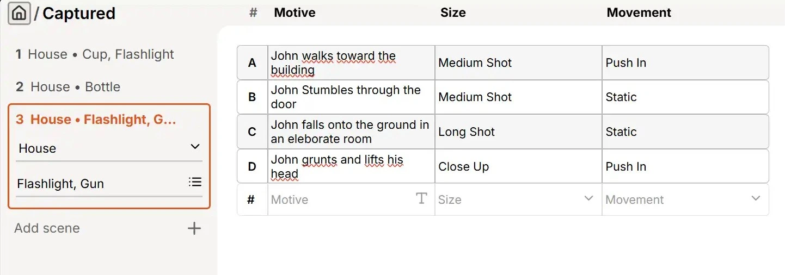
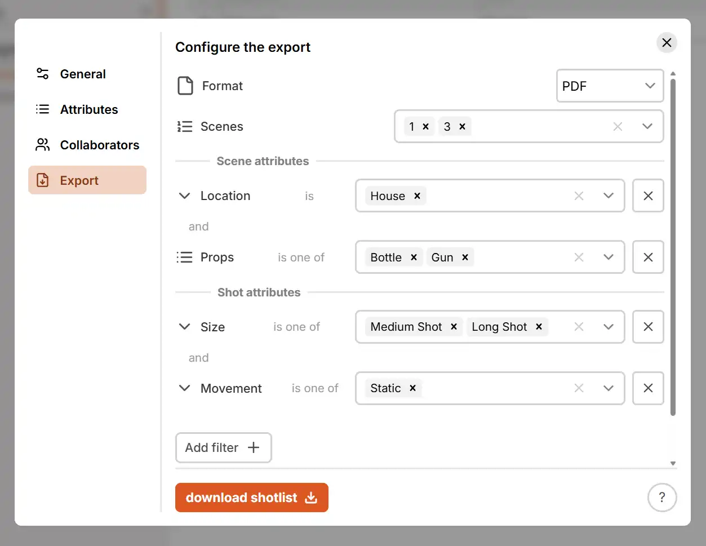
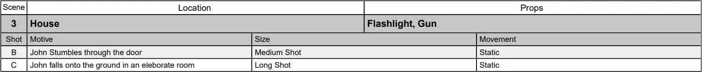

# Export

shotlists can be exported via the `Shotlist Options` > `Export` Dialog by any [Collaborator](./collaboration.md) who can view the Shotlist. Before exporting, the shotlist can be filtered to only include specific shots or scenes.

## Configuration

Currently the following **Formats** are supported:

- PDF: exports the table in a standard, print-ready, PDF format
- CSV (full): exports all the shots with scene headings in between, this makes it technically not a valid CSV file but includes all the data
- CSV (shots only): exports only the shots one after the other with no scene information other than a number in front of the shot letter

Using the **Scenes** filter you can control which scenes to include in the export. If a Scene is not included in the "Scenes" filter it will never be included, even if a custom filter matches a shot inside.

Using the `Add Filter` button, you can add a **Custom Filter** for any multiselect or singleselect attribute. You can then select a list of values that qualify for said filter. If you add a second filter, every shot/scene has to pass both the first and the second filter.

## Example

Assuming scenes having the singleselect attribute "Location" and the multiselect attribute "Props" and shots having a singleselect attribute called "Size" and another called "Movement".

The shotlist is filled with 3 scenes and a couple of shots each:

We then add all the following filters: 

By setting the "Scenes" Filter to "1, 3", scene 2 and its shots will never be included. Scene 1 and 3 *could* be included if all other filters pass.

By adding a custom filter for "Location" = "House" and adding a custom filter for "Props" = "Bottle, Gun" - Only scenes with "Location" = "House" **and** "Props" = "Bottle" or "Gun" or "Bottle, Gun" will be displayed.

| Scene | Location | Props | Passes |
| ----- | -------- | ----- | ------ |
| 1 | "House" | "Cup, Flashlight" | No |
| 2 | "House" | "Bottle" | No (The Scenes Filter does not match) |
| 3 | "House" | "Gun, Flashlight" | Yes |

This means that only shots in scene 3 will be displayed, scene 1 and 2 are ignored completely.

By adding a custom filter for "Size" = "Medium Shot, Long Shot" and adding a custom filter for "Movement" = "Static" - Only shots with "Size" = "Medium Shot" or "Long Shot" **and** "Movement" = "Static" will be displayed.

There are 4 shots in the scene number 3:

| Shot | Size | Movement | Passes |
| ---- | ------ | -------- | ---- |
| A | "Medium Shot" | "Push In" | No |
| B | "Medium Shot" | "Static" | Yes |
| C | "Long Shot" | "Static" | Yes |
| D | "Close Up" | "Push In" | No |

So in the end only scene 3 and its shot B and C will be displayed in the final export.

!!! Note
    If none of the shots in a scene pass the shot filters, the scene will not be displayed even if it passed all the Scene filters.