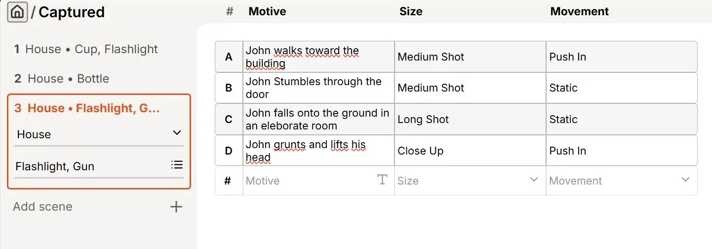
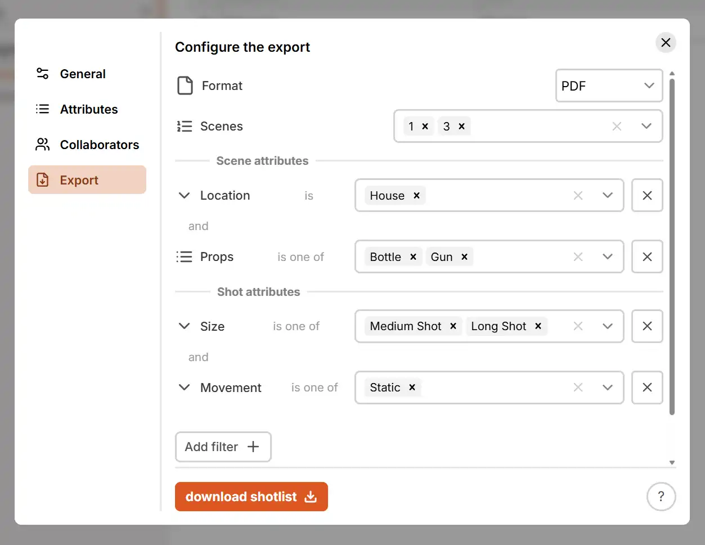
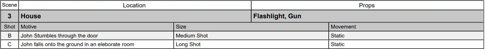

# Export

Shotlists can be exported via the `Shotlist Options` > `Export` dialog by any [Collaborator](./collaboration.md) who can view the shotlist. Before exporting, the shotlist can be filtered to include only specific shots or scenes.

By default all export settings are stored locally even if you close shotly or re-start your device. You can change this behavior using the [Account dialog](../account.md#settings)

## Formats

### PDF

Exports the table in a standard, print-ready PDF format. 

??? "PDF exclusiv settings"

    - **Add checkboxes**: whether or not to add a small blank square field in front of every shot that can be used as a checkbox once the shotlist is printed
    - **Header text**: custom text that will be displayed at the top of each page. Could be details about the shoot or any other information. If left blank, the header will not be rendered and will not take up any space
    - **Avoid single shots wrapping to new pages**: will move the whole scene to a new page if only a few shots would be on a different page than the rest
    - **Repeat scene headings after page breaks**: will repeat the scene heading (scene number and its attributes) if the scene's shots have wrapped to a new page
    - **Repeat scene attribute names on every page**: repeats the scene attribute names at the top of every page instead of just the first one

    !!! Tip
        I recommend just trying these features for yourself and downloading a few different versions to see the changes. But chances are, you will never have to change the later three.

### XLSX

Exports the shotlist as a styled **Excel list** similar to the PDF export. The resulting file is a standard *MS Excel 2007+ (.xlsx)* file.

### CSV

Exports the shotlist to a CSV file, per default this is technically not valid CSV since the scene headings are non-standard data. If [Hide scene headings](#hide-scene-headings) is toggled on, the result will have one header row and all shots in an identical format, listed below, making it a valid CSV.

## Hide scene headings

If toggled on, no scene headings will be rendered, but all scene filters and sorts will still be active. All shots are merged into one list and can now be sorted across scenes. This will automatically cause both scene and shot numbers to be shown for every shot, regardless of the users [setting](../account.md#settings) for example: scene 3, shot F - `3F`.

## Scenes filter

Using the **Scenes** filter, you can control which scenes to include in the export. If a scene is not included in the "Scenes" filter, it will never be included, even if a custom filter matches a shot inside.

## Custom filters

Using the `Add filter` button, you can add a **Custom filter** for any multi-select or single-select attribute. You can then select a list of values that qualify for that filter. If you add a second filter, every shot/scene has to **pass both** the first and the second filter.

By clicking on the `IS ONE OF` text you can change the filters mode to `IS NOT`, where selected values will be excluded.

Filters can be removed using the `X` button on the right.
    
??? Example

    Assuming the following shotlist:

    

    We then add these filters: 

    

    By setting the "Scenes" filter to "1, 3" - scene 2 and its shots will **never** be included. Scenes 1 and 3 ***could*** be included if all other filters pass.

    By adding a custom filter for "Location" = "House" and adding a custom filter for "Props" = "Bottle, Gun" - **only** scenes with "Location" = "House" **and** "Props" = "Bottle" or "Gun" or "Bottle, Gun" will be displayed.

    | Scene | Location | Props | Passes |
    | ----- | -------- | ----- | ------ |
    | 1 | "House" | "Cup, Flashlight" | No |
    | 2 | "House" | "Bottle" | No (The Scenes filter does not match) |
    | 3 | "House" | "Gun, Flashlight" | Yes |

    This means that only shots in scene 3 will be displayed - scenes 1 and 2 are **ignored** completely.

    By adding a custom filter for "Size" = "Medium Shot, Long Shot" and adding a custom filter for "Movement" = "Static" - **only** shots with "Size" = "Medium Shot" or "Long Shot" **and** "Movement" = "Static" will be displayed.

    There are 4 shots in the scene number 3:

    | Shot | Size | Movement | Passes |
    | ---- | ------ | -------- | ---- |
    | A | "Medium Shot" | "Push In" | No |
    | B | "Medium Shot" | "Static" | Yes |
    | C | "Long Shot" | "Static" | Yes |
    | D | "Close Up" | "Push In" | No |

    So, in the end: **Only** scene 3 and its shots B and C will be displayed in the final export.

    

    !!! Note
        If **none of the shots** in a scene pass the shot filters, the **scene will not be displayed**, even if it passed all the scene filters.

## Custom ordering

Using the `Add sort` button, you can add a **Custom sort** for any multi-select or single-select attribute. The shots inside each scene (or all shots if [Hide scene headings](#hide-scene-headings) is toggled on) will then be sorted by the selected attribute.

By clicking on `ASCENDING` you can toggle the sort to `DECENDING` and shots will be ordered from Z to A instead.

Sorts can be removed using the `X` button on the right.